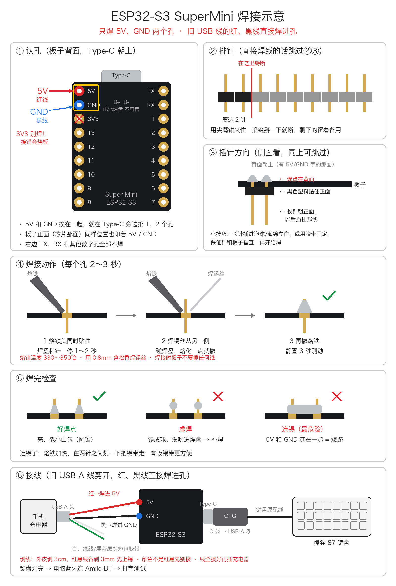

# amilo-bt

把有线 USB 键盘变成蓝牙键盘。ESP32-S3 SuperMini 当 USB 主机读键盘，再以 BLE 键盘 **Amilo-BT** 发给电脑。

实测键盘：阿米洛熊猫 87（VA87M）。Windows、macOS 都能配对，不用接收器和驱动。材料 20–30 元。

```
5V 充电器 ──红/黑线──► SuperMini 5V / GND
                          │ Type-C
                       OTG 转接头
                          │
                     有线 USB 键盘
                          ┆ 蓝牙
                         电脑
```



## 需要的东西

- ESP32-S3 SuperMini。一定要是 **S3**，C3 和普通 ESP32 没有 USB 主机
- Type-C 公转 USB-A 母 OTG 转接头
- 5V 手机充电器，加一根 USB-A 线。可以是 USB 公头转杜邦线，也可以剪一根旧线，只用 5V 和 GND 两根

## 接线

只焊 **5V** 和 **GND** 两个孔，挨着 Type-C 的第 1、2 个。**不要接 3V3。** 两个焊点要分别绝缘，中间不能连锡。做法见 [线焊接示意](线焊接示意.png)。

板子的 Type-C 一次只能做一件事：烧程序时插电脑，平时插 OTG 接键盘。

## 编译和烧录

1. Arduino IDE 2，或 arduino-cli，加 Espressif **esp32** 板级包（已验证 3.3.12）。
2. 从 [T-vK/ESP32-BLE-Keyboard](https://github.com/T-vK/ESP32-BLE-Keyboard) 下载库，解压到 `~/Documents/Arduino/libraries/ESP32_BLE_Keyboard`，打补丁：

   ```bash
   cd ~/Documents/Arduino/libraries/ESP32_BLE_Keyboard
   patch -p1 < /path/to/amilo-bt/patches/ESP32-BLE-Keyboard-core3.patch
   ```

   原版库在 3.x 核心上编译不过；就算编译过了，电脑一连它就崩溃。补丁说明见 [方案步骤](方案步骤.md#5-烧键盘程序)。

3. 开发板设置：

   | 选项 | 值 |
   | --- | --- |
   | Board | ESP32S3 Dev Module |
   | USB Mode | USB-OTG (TinyUSB) |
   | USB CDC On Boot | Disabled |
   | Flash Size | 4MB |
   | PSRAM | Disabled |
   | Partition Scheme | Huge APP |
   | CPU Frequency | 80MHz |

   命令行等价：

   ```bash
   FQBN="esp32:esp32:esp32s3:USBMode=default,CDCOnBoot=default,FlashSize=4M,PSRAM=disabled,PartitionScheme=huge_app,CPUFreq=80"
   arduino-cli compile -b "$FQBN" keyboard_bridge
   arduino-cli upload  -b "$FQBN" -p /dev/cu.usbmodemXXXX keyboard_bridge
   ```

4. 烧过这个程序后，板子插电脑不会再出现串口。要重新烧录，先**按住 BOOT 再插线**，进下载模式。

Apple 芯片的 Mac 先装 Rosetta（`softwareupdate --install-rosetta`），否则编译报 `ctags: bad CPU type`。

## 使用

接好充电器、OTG 和键盘，在电脑蓝牙里连 **Amilo-BT**。

- 同一时间只连一台电脑。换电脑前，先在原来那台上删除设备
- 系统蓝牙设置里通常没有"断开"按钮。拔掉电源就是断开，再上电会自动回连
- 板子温热（约 50 度）正常。240MHz 时会烫到七八十度，所以固件用 80MHz

## 已知限制

- 只转发普通按键和修饰键，一次最多 6 个普通键
- Fn 组合的多媒体键（音量、播放）可能不生效
- Caps Lock 灯由板子自己切换，不跟电脑同步

完整的购买、认板、接线、配对步骤见 [方案步骤.md](方案步骤.md)。
